# Quest/iOS対応までやってみるVRChatアバター改変

Unityと仲良くなるためのおまじない・Quest,iOS対応をしてやさしいせかいにする

## 目次
- [はじめに](#はじめに)
- [前提条件](#前提条件)
    - [環境](#環境)
    - [プロジェクトに入れるもの(alcomのパッケージ管理もしくはunityにimportする)](#プロジェクトに入れるものalcomのパッケージ管理もしくはunityにimportする)
- [Windows向け手順](#windows向け手順)
- [Quest・iOS対応手順](#questios対応手順)
- [参考](#参考)
- [Blueprint IDについて](#blueprint-idについて)
- [Tips集](#tips集)
- [配下ページ](#配下ページ)

## はじめに

- 書いた人:[(u_)たかなし（@u_takanashi_VRC](https://x.com/u_takanashi_VRC)
    - お問い合わせはわかる範囲で回答します
- ツールごとのくわしい使い方は配布サイトなどを参照(ここで適当なことを言ってもいけないので)
- 主にQuest対応時の気をつける場所がメイン

## 前提条件

### 環境

- Unityと和解しようとする心
- Macbook Pro (M1Pro 2021)
    - Harmony Patches for Apple Silicon native & Rosettaのインポートと備考に記載のコトを読み飛ばせばWindowsでも対応できます。
- ALCOM + Unity 2022.3.22f1
    - UnityにはWindows・Android・iOS build環境を組んでおく
        - 自環境のWindows版Unity Hubからだと2022.3.22f1用のiOSビルド環境が組めなかったので下記ページのComponent installers→Windowsを開き、iOS Build Supportをダウンロードしてインストールした
            - https://unity.com/releases/editor/whats-new/2022.3.22f1#installers
        - そうしないとiOS対応までできない、後述しますが改変目的の人はiOS対応までユーザー側でしてあげると**「やさしいせかい」**になります

### プロジェクトに入れるもの(ALCOMのパッケージ管理もしくはUnityにImportする)

| 概要 | パッケージ | 備考 | 場所 |
| --- | --- | --- | --- |
| Apple silicon Macで作業するなら前提 | Harmony Patches for Apple Silicon native & Rosetta | (無いとMetal環境でHarmonyがうごかん、これで動くけど一部シェーダーはマテリアルエラーになる(アップロードすると戻るので作業中は我慢)) | ALCOMへプリロード済 |
| シェーダー | liltoon | アバター・各種アセットに応じて、ここではしなのちゃん必須のもの | [https://lilxyzw.github.io/lilToon/](https://lilxyzw.github.io/lilToon/) |
| モジュール支援 | Modular Avatar | 対応アバター&アセットならポン付けでいい感じに動かしてくれるスグレモノ | [https://modular-avatar.nadena.dev/ja](https://modular-avatar.nadena.dev/ja) |
| Quest対応支援 | VRCQuestTools | Windows向けだけなら要らないけどどうせならQuest対応しましょ | [https://kurotu.github.io/VRCQuestTools/ja/](https://kurotu.github.io/VRCQuestTools/ja/) |
| Quest対応支援 | AAO: Avatar Optimizer | 同上 | [https://vpm.anatawa12.com/avatar-optimizer/ja/](https://vpm.anatawa12.com/avatar-optimizer/ja/) |
| Quest対応支援 | lilAvatarUtils | これ基本的には不要かも、入れてても悪さはしませんので必要に応じて | liltoonに内包 |
| 動作確認支援 | gesture manager | ジェスチャーなどのVRC動作をUnity上で再現するためのツール(UnityのPlay機能の上位互換) | ALCOMへプリロード済 |
| PC向け非破壊軽量化 | LAC Texture Compressor | PC版はこれで気持ち軽くしておいた方がいいと思う | [https://lac.limitex.dev/ja/docs/installation/](https://lac.limitex.dev/ja/docs/installation/) |
| メッシュ軽量化 | Meshia Mesh Simplification | モバイル対応で無理やりPoorなどにする場合の最終手段なので基本なくていい、手順も割愛 | [https://ramtype0.github.io/Meshia.MeshSimplification/index.html](https://ramtype0.github.io/Meshia.MeshSimplification/index.html) |

## Windows向け手順

1. ALCOMで「プロジェクトを作成」を押下して新規作成
    1. テンプレート:VRChat Avatars
    2. Unityバージョン:2022.3.22f1
    3. プロジェクト名:なんでもよいです。素体名・バージョンの組み合わせが今後増えてくる前提で管理しやすいかも？
    4. 作成パス:デフォルトでOK

        <a href="image/main/forWindows/ALCOM_Proj_Setting.png" target="_blank">
            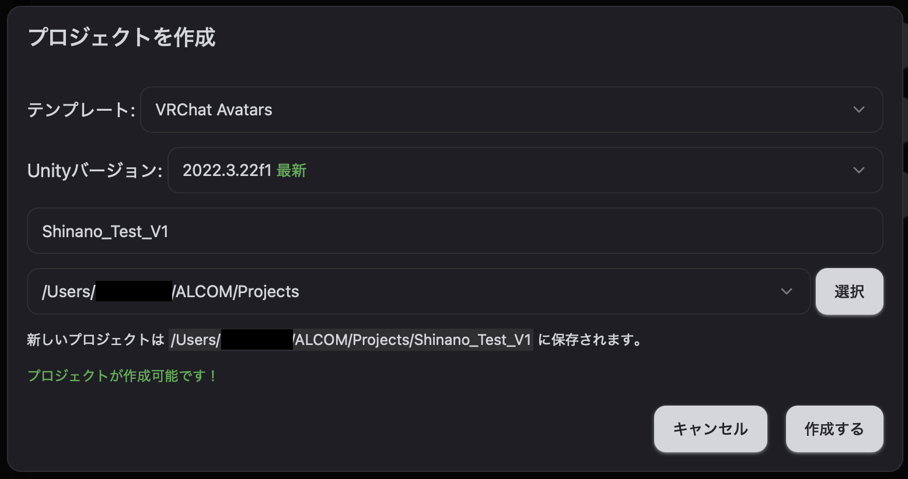
        </a>
        
    
2. パッケージ管理画面が表示されるので[プロジェクトに入れるもの(ALCOMのパッケージ管理もしくはUnityにImportする)](#プロジェクトに入れるものalcomのパッケージ管理もしくはunityにimportする) を参考に最新版をインストールする
    - LAC Texture Compressorはパッケージ追加時点だと「Avatar Compressor」という名前になっているはず、URLがlimitex.devになっているもの
3. Unityを開く
4. アバターのunitypackageをダブルクリックで開いてUnityへImport

    <a href="image/main/forWindows/ImportUnityPackage.png" target="_blank">
        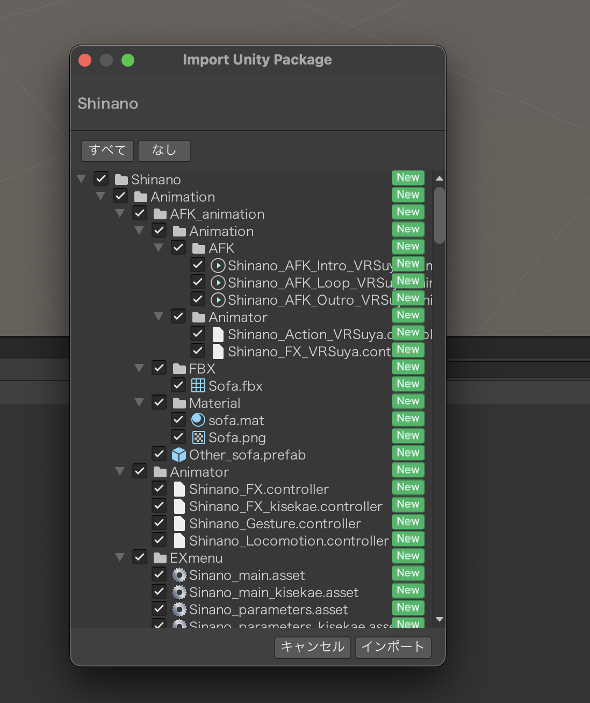
    </a>
    
5. Assetsからアバターのprefabを選らんでhierarchyにドラッグ&ドロップ
    - 一回引っかかったのがAssetsのprefabをダブルクリックで開くとprefabのプレビューみたいな状態になるのでNG、必ずドラッグ&ドロップで配置

        <a href="image/main/forWindows/Avater_placement.png" target="_blank">
            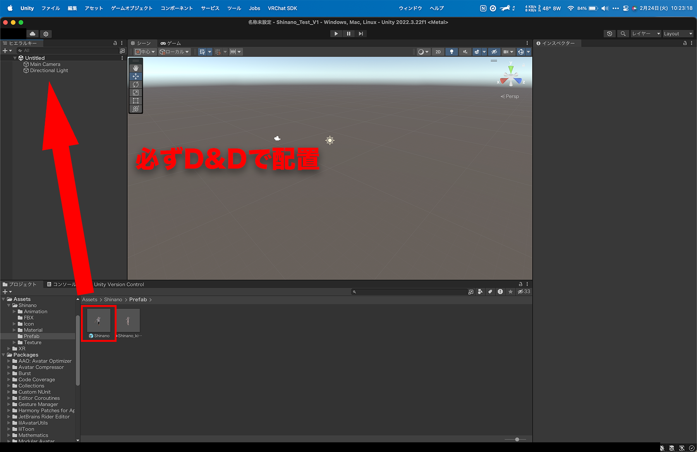
        </a>
        
        <a href="image/main/forWindows/Avater_placement_comp.png" target="_blank">
            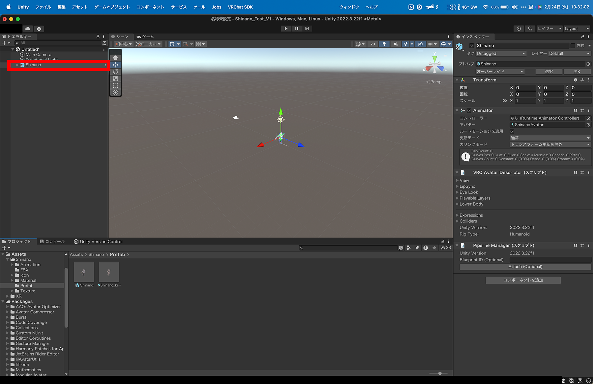
        </a>

6. Cmd+S(Win:Control+S)を押下してシーンを保存しておく
    - アップロード時に強制的に保存させてくるはずなのでここでやっておけばいい
        - ファイル名は任意、場所は変えない
        
        <a href="image/main/forWindows/scene_save.png" target="_blank">
            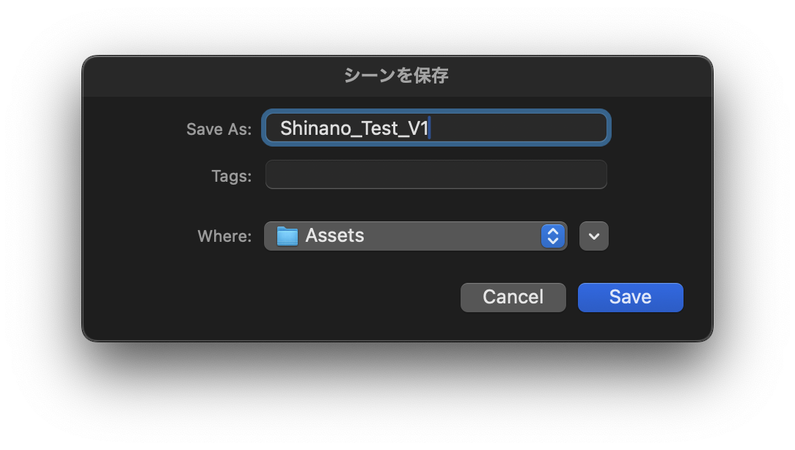
        </a>

7. 改変するところは改変する(改変方法は販売ページや他参照)
    1. プレビューのたびにカメラ動かすのが怠いのでMainCameraの位置を変えておくとよい
        
        Main Cameraのinspectorのtransformオススメ設定↓
        
        <a href="image/main/forWindows/maincamera_recommendsettings.png" target="_blank">
            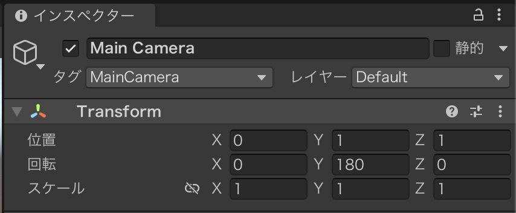
        </a>
        
8. LAC Texture Compressorをアバター本体にコンポーネント追加して設定(クソ重い以外はHigh qualityでいい)
    1. 圧縮後の容量を知りたい場合はPreview Compression Resultsを押下すれば出てくるよ
        - 必須ではないが何も考えずにアップロードしていると100MBを余裕で超えるので大人数集まったときに誰も幸せになりません。コンポーネント追加とプリセットを選ぶだけなのでやっておきたいです。
        
        <a href="image/main/forWindows/LAC_install.png" target="_blank">
            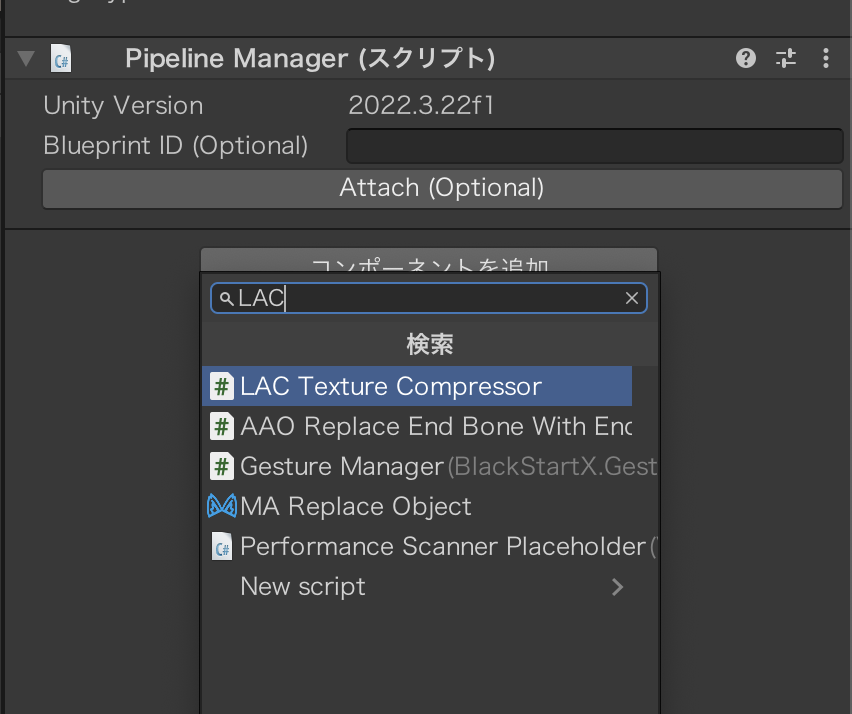
        </a>

        <a href="image/main/forWindows/LAC_settings.png" target="_blank">
            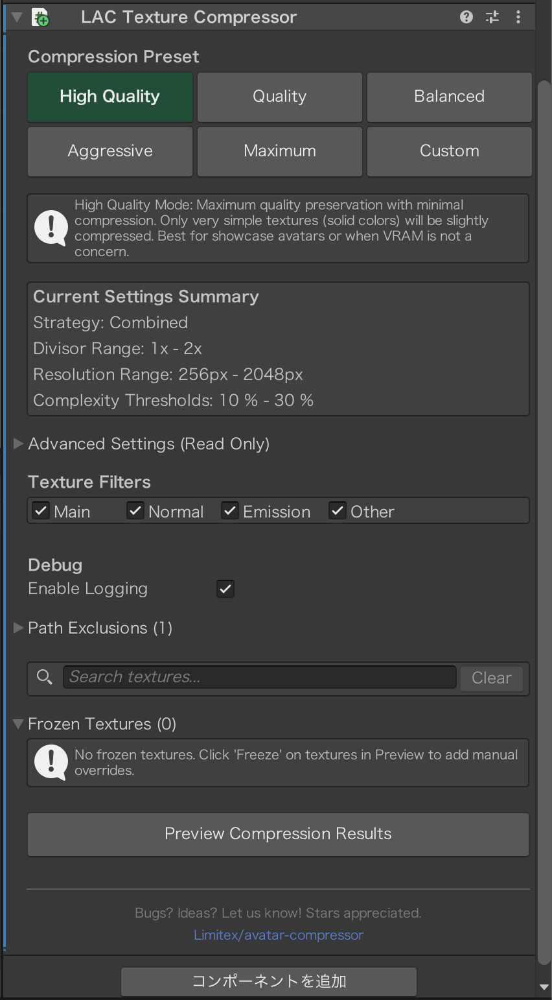
        </a>
    
9. メニューのVRChat SDKからShow Control Panelを押下してWindows向けアップロード
    1. 確認するべきところ
        - 1.Prepare Your Content
            - Name:必ず記入、特別なことがなければプロジェクト名と同名でOK
            - Visibility:必ずPrivate
            - 写真:Capture In Sceneを押せばいいです
        - 2.Review Any Alerts
            - ！が八角形で覆われているエラーが出ている時は基本的に「Auto FIX」が出ているはずなので押してしまう
            - 他は無視しても基本大丈夫だが、エラーであることは変わりないので読んでおく
        - 3.Build
            - Build Type:Build & Publish Your Avatar Online
            - Platform(s):Windows
        
        
        <a href="image/main/forWindows/VRCSDK_Windows.png" target="_blank">
            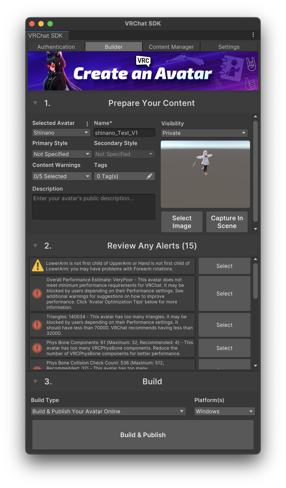
        </a>

## Quest・iOS対応手順

1. Windows向け手順で作成した完成版のプロジェクトをALCOM上で複製
    - ファイル名はWindows向けの後ろに「_Quest」とかを付けるといいかんじ
    - 軽い改変であれば非破壊で変換できるので複製する必要はないが、Quest対応で破壊作業や一部削ったりする必要が出てくる可能性があるので安全のためWindows向けとは別のプロジェクトで管理した方が無難
    
    <a href="image/main/forQuest/project_repro.png" target="_blank">
        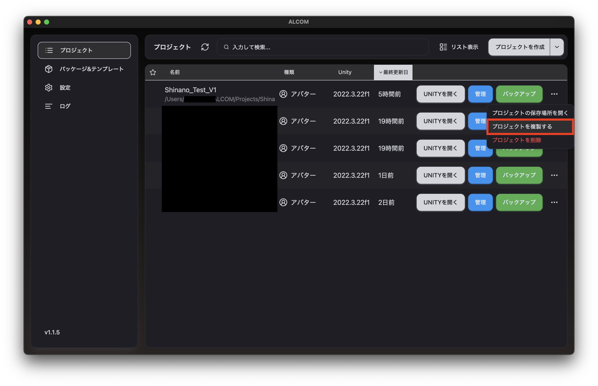
    </a>

    <a href="image/main/forQuest/project_repro_detail.png" target="_blank">
        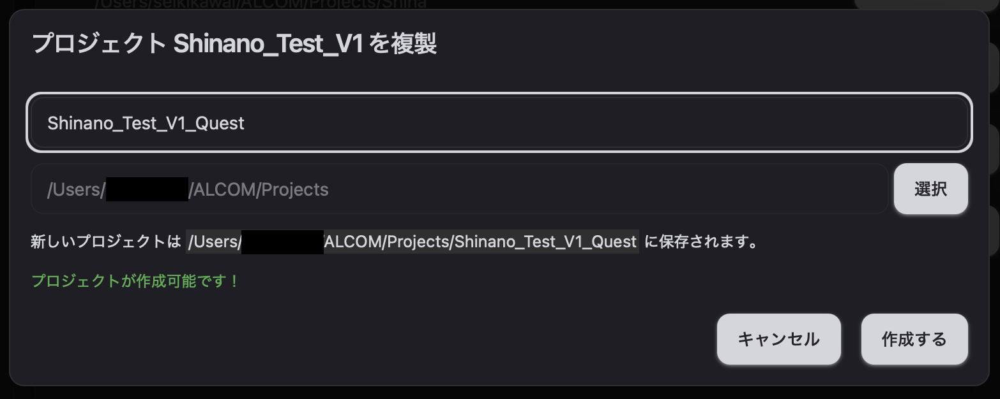
    </a>
    
2. 前提条件のQuest対応支援パッケージをプロジェクトへ追加していない場合はここで追加
3. Unityを開く
4. AAO Trace And Optimizeをアバター本体にコンポーネント追加して設定
    1. 入れるだけで勝手に動いてくれます
    2. LAC Texture Compressorはここで消しておく
5. Unityのメニューバーからツール→VRCQuestTools→Convert Avatar for Androidを起動
    1. 起動してコンバーターの設定を開こうとすると警告がでます
        - 内容としては「先にWindows向けのアップロードを済ませてね」(超雑翻訳)なので手順通りやっている場合は問題なし
            
            <a href="image/main/forQuest/VRCQ_notice.png" target="_blank">
                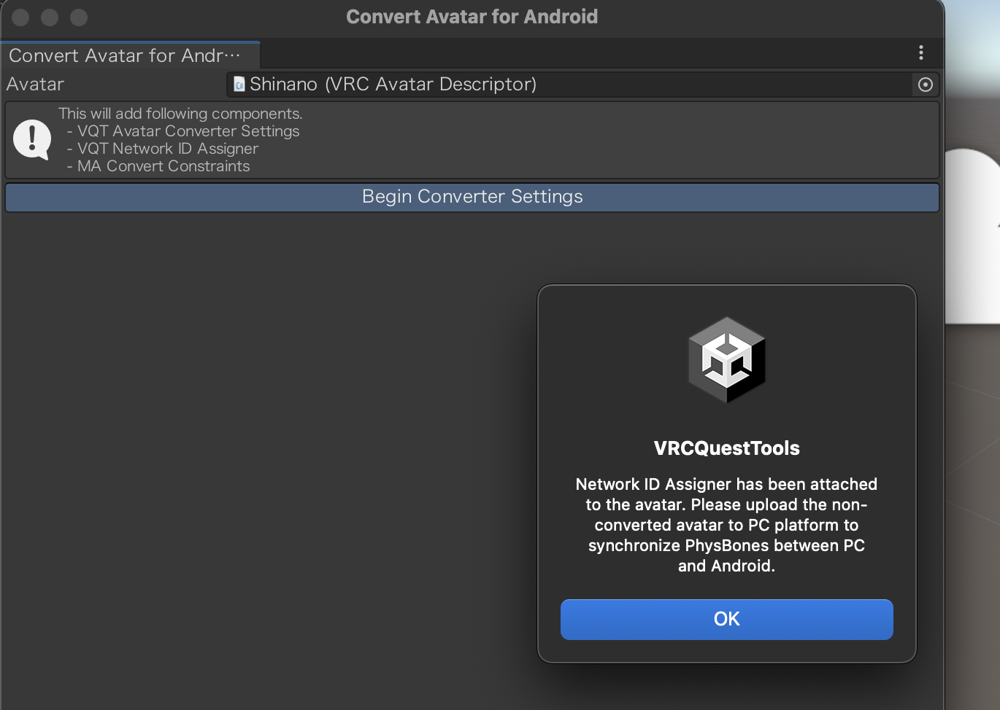
            </a>

    2. 英語表示になっている場合はLanguageで日本語にすると見やすい
    3. マテリアル変換設定から最大テクスチャサイズをとりあえず512へ
    4. 容量オーバーしてしまう場合はマテリアル変換設定から圧縮形式を ASTC8×8へ
    5. Avater DinamicsはPhysBones欄の全てを一旦選択解除し、最大8個の制限内で選択しなおす。
        - 個人的最適解(ご参考までに)
            - [Avater Dinamics→PhysBonesの個人的最適解](subpage/Tips.md#avater-dinamicsphysbonesの個人的最適解)
        - デフォしなのちゃんの場合のたかなし流設定
            - [Avater Dinamics→PhysBones設定](subpage/Shinano_uniquesettings.md)
    6. 非破壊的に変換するを押下

    <a href="image/main/forQuest/VRCQ_settings.png" target="_blank">
        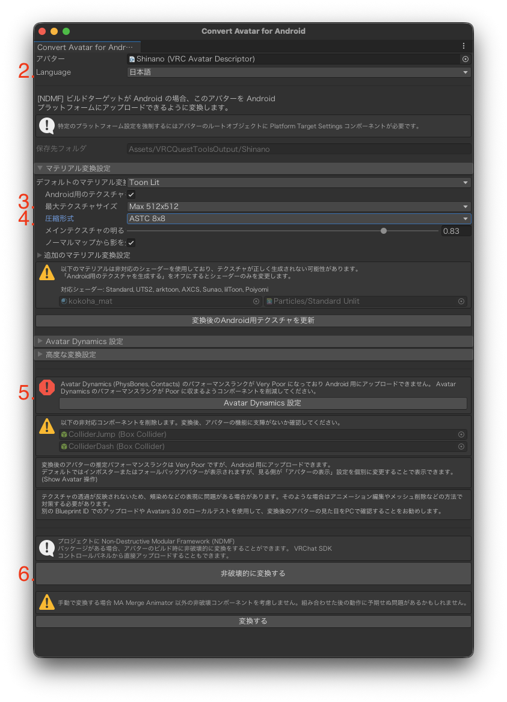
    </a>

6. VRChatSDKを開いてくださいと言われるので従う
7. VRChatSDKのアップローダーでbuildをAndroidへ変更し、Unityにビルド準備してもらう
    - ここではbuild設定の変更のみ！アップロードはもう少しあとで
8. [**NoriBlocker**をboothから導入](https://riceworks.booth.pm/items/5808613)、インポートしてアバターの一番下へ挿入
    - せっかくのお気に入り子をQuest/iOSからも綺麗に見れるようになるので絶対やった方がいい…
9. メガネなどレンズ系でシェーダーが別途使われている場合はそのシェーダーをVRChat/Mobile/Particles/Multiplyへ修正
    - Quest/iOSに対応してないシェーダーを使うとちゃんと見えないので対策
        
        <a href="image/main/forQuest/Shader_glass.png" target="_blank">
            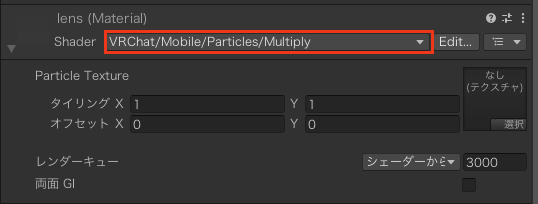
        </a>
    
10. アクセサリーなど金属表現のシェーダーが別途使われてる場合はそのシェーダーをVRChat/Mobile/Standard Liteへ修正
    1. Main Mapsのアルペドを好みの色味へ修正する
        
        <a href="image/main/forQuest/Shader_metal.png" target="_blank">
            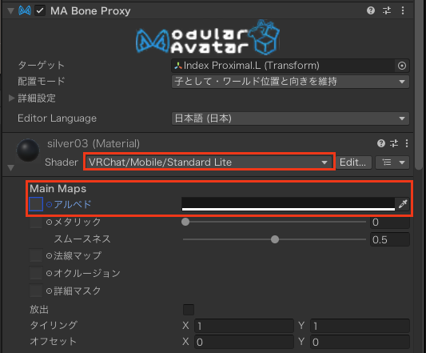
        </a>
    
    
11. gesture managerから動作確認(主に8で対策した表情・9および10で変更したシェーダーの部分)
    - 動作確認時の操作イメージ
        
        <blockquote class="twitter-tweet" data-media-max-width="560">
赤くなる海苔現象解消っぽい、やったー <a href="https://t.co/u3et4PX9Mt">pic.twitter.com/u3et4PX9Mt</a>
&mdash; (u_)たかなし (@u_takanashi_VRC) <a href="https://twitter.com/u_takanashi_VRC/status/2025430707200557212?ref_src=twsrc%5Etfw">February 22, 2026</a></blockquote> 
        
12. とりあえずVRCQuestTools経由でAndroid向けにアップロードしてみる
    1. SDK側からだと万が一容量オーバーしているとWindows向けごとアップロード済みアバターがSecurity Checkで死ぬのでそれの対策
        
        <a href="image/main/forQuest/build_publish_Android.png" target="_blank">
            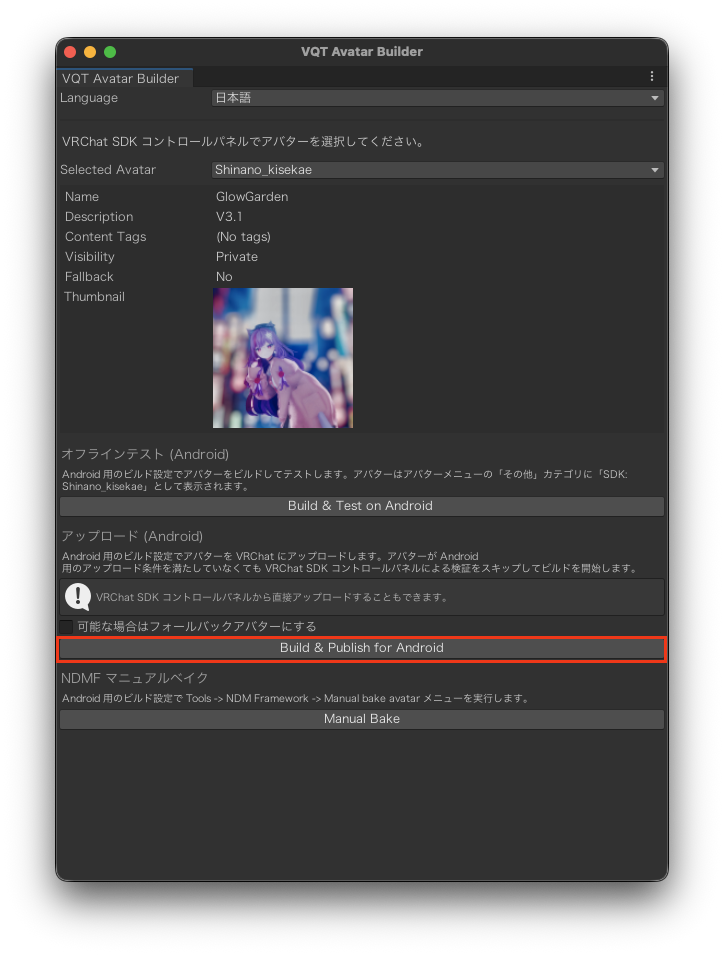
        </a>
    
13. 上記9の手順がうまく行ったらVRChatSDKのアップローダーでbuildをiOSへ変更し、ビルド準備してもらった上でアップロード
    - Android向けアップロードでiOSへ自動変換が機能することを確認した。
        
        が、どうやら自動変換は意図しない見た目・挙動になる気がするので余裕があればiOSビルドも行った方がいい。
        

## 参考

- パフォーマンスランクの基準(公式ドキュメント)
    - https://creators.vrchat.com/avatars/avatar-performance-ranking-system/#section-avatar-performance-ranks-value-maximums-per-rank
- レンダーキューについて
    - https://vrnavi.jp/vrchat-renderqueue/

## Blueprint IDについて

- ベースのモデル(ギミックだけ入れたテンプレートなど)を作成し、プロジェクトコピーで作業する場合はBlueprint IDの新規発行が必要
    - そうしないとベースモデルで1回でもアップロードしていた場合、そいつが上書きされちゃう
- アバター本体のinspectorにPipeline ManagerがあるのでそこのBlueprint IDにIDが入っていればDetach (Optional)を押下してデタッチしてやる
    - 逆にQuest対応とかで紐付けが必要な場合はAttach(Optional)をする必要がある
        - プロジェクト複製のやり方なら紐付けは維持されているはずなので考えなくていいと思う

## Tips集

[簡単なトグルの作り方](subpage/Tips.md#簡単なトグルの作り方) 

## 配下ページ

[改訂履歴](subpage/RevHis.md)

[しなのちゃん固有設定](subpage/Shinano_uniquesettings.md)

[メモ](subpage/Memo.md)

[Tips集](subpage/Tips.md)