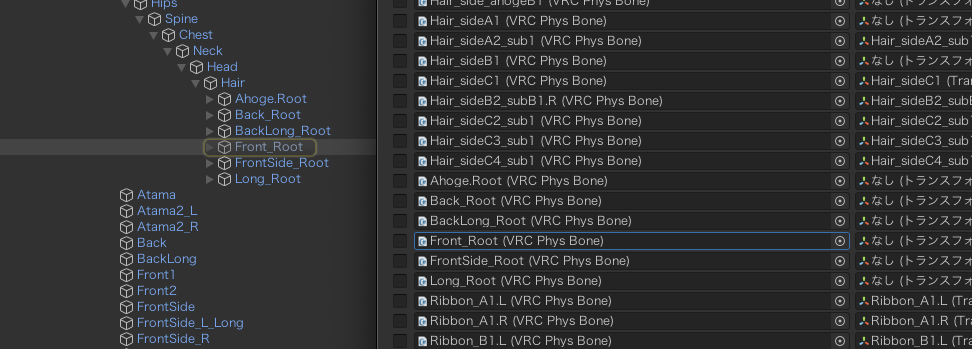
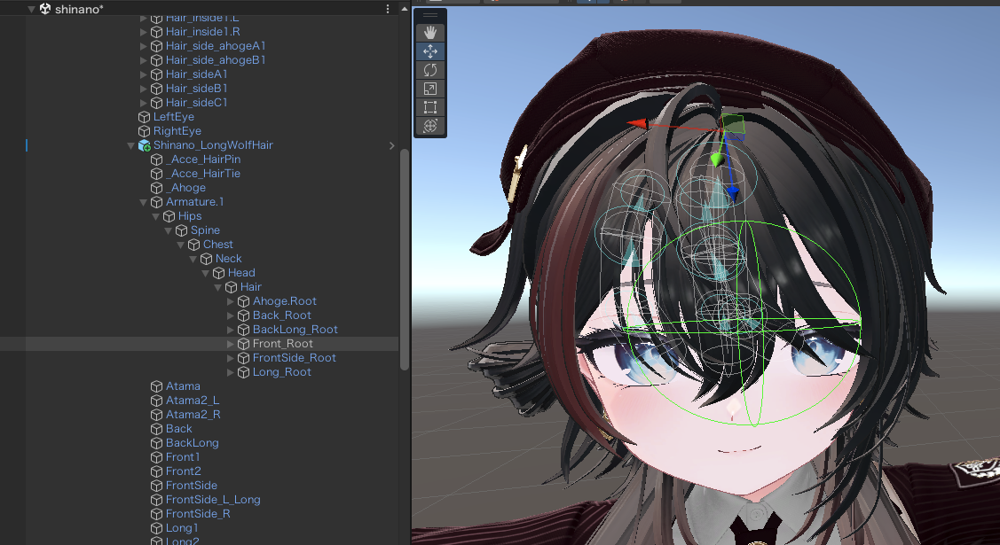
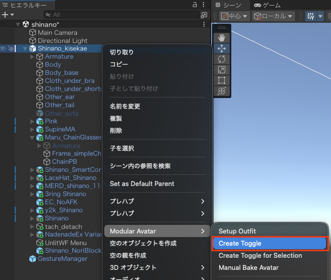
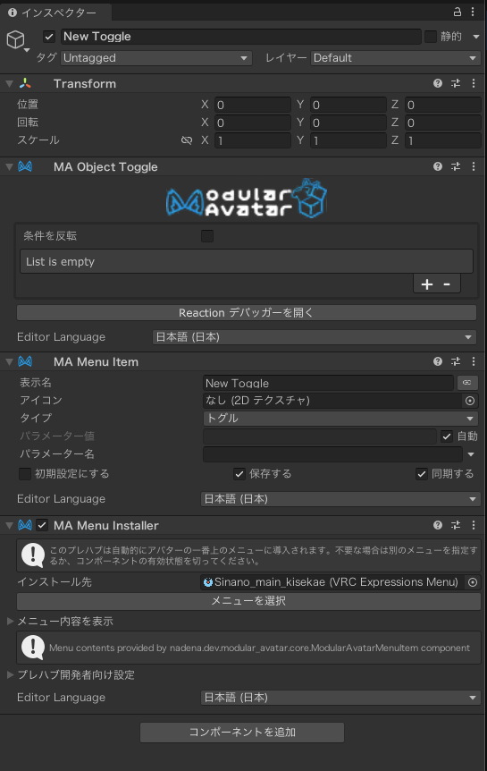

# Tips集

必須ではないが「やって良かったな」を列挙

## Avater Dinamics→PhysBonesの個人的最適解

- 用途によって変えたいが、フレンドさんに言われたのはやはり顔まわり(特に前髪)が動くと素敵な世界になりそう。

1. PhysBonesを押下するとヒエラルキー側でハイライトされる
    - ここでは「Front_Root (VRC Phys Bone)」を選択している

        

2. ハイライトされたものをヒエラルキーから選択するとどこの部分かが見れる

    

3. 選択された場所を参考にしながらAvater Dinamics→PhysBonesを選択していくと良いと思います。
    - もちろんパフォーマンスランクの制限がかなり厳しいのでできる範囲で選択していく

## 簡単なトグルの作り方

1. ヒエラルキーからアバターを右クリック
2. メニューからModular Avatar→Create Toggleを押下

    

3. New Toggleが出来上がるのでインスペクターから各種設定
    1. 名前を任意のものへ
    2. MA Object ToggleからList is emptyとなっているところの+を押下
    3. 取り外したい、機能をトグルでON/OFFしたいものをドラッグ&ドロップで配置する
    4. 初期をOFFとしたい場合は「条件を反転」へチェックする
    
        

4. Gesture managerから動作確認

[← メインページに戻る](../index.md)